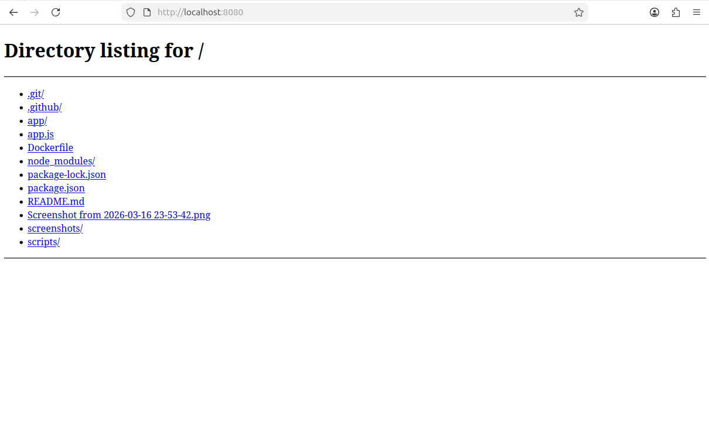

## Application Screenshot

# AWS DevOps Deployment Project

This project demonstrates a simple DevOps workflow deploying an application to AWS EC2.

Technologies:
- AWS EC2
- GitHub
- Linux
- Python

Architecture:
Developer -> GitHub -> AWS EC2 -> Running Application

Deployment:

git clone repo
cd devops-project
bash scripts/deploy.sh
